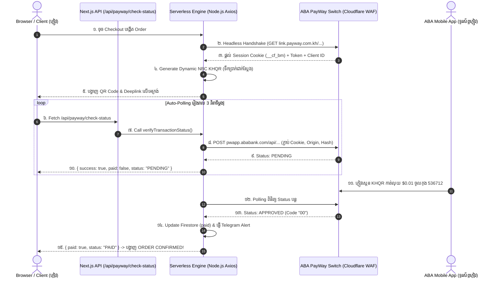

# យុទ្ធសាស្ត្ររួម៖ ABA PayWay Headless Dynamic QR Engine លើ Cloud (Vercel)

ឯកសារនេះរៀបរាប់លម្អិតអំពីស្ថាបត្យកម្ម (Architecture), យុទ្ធសាស្ត្របច្ចេកវិទ្យា (Technical Strategy), និងជំហានអនុវត្តជាក់ស្ដែង ក្នុងការបង្កើតប្រព័ន្ធទូទាត់ប្រាក់ **ABA KHQR Dynamic Auto-Verification** ដោយដំណើរការលើ **Cloud Serverless (Vercel)** ពេញលេញ ១០០% ដោយមិនចាំបាច់មាន Hardware ឬ Official Enterprise Merchant Contract ពីធនាគារឡើយ។

---

## ១. បញ្ហាប្រឈម និងហេតុផលនៃការបង្កើតយុទ្ធសាស្ត្រនេះ (The Problem & Motivation)

### ក. ដែនកំណត់នៃ Official PayWay v2 Merchant API
ដើម្បីទទួលបាន **Official Merchant API Key (HMAC Secret)** ពីធនាគារ ABA អាជីវកម្មទាមទារ៖
1. មានការចុះបញ្ជីក្រុមហ៊ុនស្របច្បាប់ (Company Registration / Patent)
2. ទៅចុះកិច្ចសន្យាផ្ទាល់នៅធនាគារ និងរង់ចាំការត្រួតពិនិត្យឯកសាររាប់សប្តាហ៍
3. បង់ថ្លៃ Setup Fee និងកម្រៃជើងសារប្រចាំខែ (Monthly Fees)
👉 **ផលវិបាក៖** ម្ចាស់ Shop ឬ Developer ទូទៅមិនអាចភ្ជាប់ប្រព័ន្ធបង់ប្រាក់ស្វ័យប្រវត្តបានភ្លាមៗឡើយ។

### ខ. ភាពទន់ខ្សោយនៃវិធីសាស្ត្របុរាណ (Archaic Workarounds)
អ្នកអភិវឌ្ឍន៍មួយចំនួនធ្លាប់ប្រើវិធីសាស្ត្រជំនួស ប៉ុន្តែមានហានិភ័យខ្ពស់៖
* **វិធីទី ១ (Notification Forwarder លើ Android):** ត្រូវទិញទូរស័ព្ទ Android ដោតសាកថ្ម ២៤/៧ ចោល ដើម្បីចាំលួចស្ដាប់ Notification របស់ ABA Mobile រួចបាញ់ Webhook។ (ហានិភ័យ៖ ប៉ោងថ្មទូរស័ព្ទ, ដាច់ WiFi, ទូរស័ព្ទ Sleep, មិនដំណើរការលើ iPhone/iOS)។
* **វិធីទី ២ (Local Laptop Proxy នៅកម្ពុជា):** ត្រូវបើកកុំព្យូទ័រ Laptop មួយចោលប្រើអ៊ីនធឺណិត Smart/Cellcard ដើម្បីដើរតួជា Proxy ជៀសវាង Cloudflare ប្លុក IP ក្រៅប្រទេស។ (ហានិភ័យ៖ ដាច់ភ្លើង, ដាច់អ៊ីនធឺណិត, ម៉ាស៊ីនខូច នោះវេបសាយទាំងមូលនឹងគាំង)។

---

## ២. ដំណោះស្រាយកម្រិតខ្ពស់៖ Headless Serverless Engine

ពួកយើងបានបង្កើត **យុទ្ធសាស្ត្រទី ៣ (Direct Serverless Session Spoofing)** ដែលទាញយកផលប្រយោជន៍ពី **Public ABA PayWay Link** (`link.payway.com.kh/ABAPAYaA536712c`) ដែលម្ចាស់គណនី ABA គ្រប់រូបអាចបង្កើតបានដោយសេរីក្នុងកម្មវិធី ABA Mobile App។

### 📊 ស្ថាបត្យកម្មលំហូរទិន្នន័យ (Data Flow Architecture)



---

## ៣. យន្តការស្នូលទាំង ៤ ជំហាន (Core Engine Implementation)

យុទ្ធសាស្ត្រនេះត្រូវបានបែងចែកជា ៤ ដំណាក់កាលបច្ចេកទេសក្នុងកូដ `src/services/paymentService.ts`៖

### ជំហានទី ១៖ Headless Handshake & Session Extraction
នៅពេលអតិថិជនចុច Checkout Serverless Backend របស់ Vercel នឹងធ្វើការក្លែងខ្លួនជា Browser ដើម្បីបើកទំព័រ PayWay Link របស់ហាង៖
* **Target:** `https://link.payway.com.kh/ABAPAYaA536712c`
* **Headers:** ប្រើ User-Agent របស់ Chrome 131 នៅលើ Windows 10
* **ផលដែលទទួលបាន:**
  1. `__cf_bm` Cookie (Cloudflare Bot Management Clearance Cookie)
  2. `clientId` (ឧ. `2241304-536712-30639097`)
  3. `token` (Cryptographic Session Token របស់ ABA)
  4. `tranId` (Transaction ID ផ្លូវការ)

### ជំហានទី ២៖ Dynamic NBC EMVCo KHQR Generation & Deeplinks
ប្រើប្រាស់បណ្ណាល័យ `rotana-khqr-deeplink` ដើម្បីកែច្នៃ KHQR Payload ឲ្យមានទិន្នន័យជាក់លាក់៖
* ភ្ជាប់ Tran ID ស្រស់ៗពី ABA
* កំណត់ទឹកប្រាក់ជាក់ស្ដែង (Dynamic Amount: $0.01 សម្រាប់ Test ឬតម្លៃខោអាវជាក់ស្ដែង)
* បង្កើត Universal Deeplinks ស្វ័យប្រវត្តិ៖
  * **ABA Mobile:** `intent://ababank.com?type=payway&qrcode=...`
  * **Bakong App:** `intent://open?qr=...`
  * **ACLEDA Mobile & Wing Bank:** App-specific URL schemes

### ជំហានទី ៣៖ Stealth Polling (ការត្រួតពិនិត្យលុយរាល់ 3s ដោយមិនបែកការណ៍)
នៅពេលផ្ទាំង QR បង្ហាញលើ Browser វេបសាយនឹង Polling ទៅកាន់ API ខាងក្នុង `/api/payway/check-status` ហើយ Backend នឹងសួរទៅកាន់ ABA Switch ផ្ទាល់៖
* **Target:** `https://pwapp.ababank.com/api/pw-app/v1/payment-link/check-payment-status`
* **ក្បាច់លាក់ខ្លួន (Stealth Headers):**
  ```typescript
  const headers = {
    "Content-Type": "application/json",
    "Origin": "https://link.payway.com.kh",
    "Referer": "https://link.payway.com.kh/ABAPAYaA536712c",
    "User-Agent": "Mozilla/5.0 (Windows NT 10.0; Win64; x64) Chrome/131.0.0.0 Safari/537.36",
    "token": token,
    "Cookie": cookie, // ផ្ទុក __cf_bm Cookie
  };
  ```
* **ការគណនា Hash របស់ ABA (Security Algorithm):**
  ```typescript
  const hashPayload = clientId + deviceId + requestTime;
  const hash = crypto.createHash("sha512").update(hashPayload, "utf8").digest("hex");
  ```
* **លទ្ធផល៖** ABA Server និង Cloudflare WAF មើលឃើញថា Request នេះ **ចេញពីទំព័រ PayWay ផ្លូវការរបស់ខ្លួនឯង ១០០%** ដូច្នេះវាមិនដែលប្លុកឡើយ ហើយឆ្លើយតប Code `00` មកវិញរាល់ពេល។

### ជំហានទី ៤៖ Auto-Confirmation, Database Update & Telegram Notification
នៅពេល ABA ឆ្លើយតបថា `action === "approved"` ឬ `status === "paid"`៖
1. **Firestore Sync:** Update order status ទៅ `Confirmed` និង `paymentStatus: "paid"`
2. **Telegram Bot Alert:** ផ្ញើសារ Real-time ទៅ Telegram Group របស់ម្ចាស់ហាងភ្លាមៗ
3. **Frontend UI Switch:** Checkout Modal ប្តូរទៅជាផ្ទាំងអបអរសាទរពណ៌មាស **"ORDER CONFIRMED"**។

---

## ៤. ហេតុអ្វីបានជា Cloudflare មិនប្លុក Vercel IP? (Anti-WAF Secrets)

មនុស្សភាគច្រើនគិតថា Cloudflare នឹងប្លុក IP Datacenter របស់ Vercel/AWS ជានិច្ច ប៉ុន្តែក្នុងប្រព័ន្ធយើង Cloudflare អនុញ្ញាតឲ្យឆ្លងកាត់ដោយសារមូលហេតុ ៣ យ៉ាង៖
1. **Valid Cookie Reuse:** យើងមិនបាញ់ Request ព្រាវៗទេ! យើងធ្វើ Handshake យក Cookie `__cf_bm` ដែល Cloudflare ចេញឲ្យស្របច្បាប់ពីដំបូង យកមកភ្ជាប់ជាមួយគ្រប់ Request បន្ទាប់ទាំងអស់។
2. **Public Link Exception:** Domain `link.payway.com.kh` ត្រូវបាន ABA បង្កើតឡើងសម្រាប់មនុស្សទូទាំងពិភពលោកបើកមើល ដូច្នេះ Cloudflare Rule របស់គេមិនប្លុក IP ក្រៅប្រទេសឡើយ ដរាបណាមាន Valid User-Agent និង Parameters ត្រឹមត្រូវ។
3. **Human Jitter Polling:** ក្នុង Client Code យើងមិន Polling គត់ 3000ms ស្មើគ្នាដូចម៉ាស៊ីនទេ យើងបានដាក់ Random Jitter `delay = 3000ms ± 200ms` ដើម្បីឲ្យមើលទៅដូចចង្វាក់ Browser ធម្មតា។

---

## ៥. ការរៀបចំ Environment Variables លើ Vercel Production

ដើម្បីឲ្យប្រព័ន្ធនេះដំណើរការ ១០០% លើ Vercel បងគ្រាន់តែបញ្ចូល Variables ខាងក្រោមក្នុង **Vercel -> Settings -> Environment Variables**៖

| Variable Name | Sample Value | ការពន្យល់ |
| :--- | :--- | :--- |
| `PAYWAY_CHECKOUT_URL` | `https://link.payway.com.kh/ABAPAYaA536712c` | Link PayWay របស់ហាងបង (សំខាន់បំផុត) |
| `NEXT_PUBLIC_PAYMENT_TEST_MODE` | `true` (Test $0.01) / `false` (Real Price) | បើ `true` គិតលុយ $0.01 ពេល test |
| `NEXT_PUBLIC_TEST_AMOUNT_USD` | `0.01` | ចំនួនទឹកប្រាក់សម្រាប់ Test |
| `NEXT_PUBLIC_ABA_BANK_ACCOUNT_NAME` | `THOUN SOTHEARA ANALITEKIT` | ឈ្មោះម្ចាស់គណនី PayWay |
| `NEXT_PUBLIC_ABA_BANK_ACCOUNT_NUMBER` | `536712` | លេខកូដគណនី PayWay |
| `NEXT_PUBLIC_ABA_PAYWAY_MERCHANT_ID` | `DELIGHT_FASHION_KH` | ID សម្គាល់ហាង |

---

## ៦. គុណសម្បត្តិប្រៀបធៀប (Advantages Summary)

| លក្ខណៈ | ក្បាច់បុរាណ (Android / Laptop) | ក្បាច់ថ្មី (Serverless Headless Engine) |
| :--- | :--- | :--- |
| **ការចំណាយ Hardware** | ត្រូវការទូរស័ព្ទ Android ឬ Laptop ចោល | **$0 (គ្មាន Hardware សូម្បីតែមួយ)** |
| **ហានិភ័យដាច់ភ្លើង/WiFi** | ខ្ពស់បំផុត (ដាច់ភ្លើង ដាច់កូដ) | **គ្មានហានិភ័យ (Vercel Cloud 99.99% Uptime)** |
| **ការគាំទ្រ iOS / iPhone** | មិនអាចប្រើបានលើ iPhone | **ដំណើរការលើគ្រប់ Device (iOS, Android, PC)** |
| **ការបំប្លែងតម្លៃ (Dynamic Amount)** | ភាគច្រើនបានតែ QR ងាប់ (Static) | **Dynamic KHQR ដូរទឹកប្រាក់តាម Cart ដោយស្វ័យប្រវត្តិ** |
| **សុវត្ថិភាពលាក់ខ្លួន** | អាចបែកធ្លាយតាមរយៈ local network | **លាក់ក្នុង Serverless ជិតឈឹង ABA ឃើញដូចទំព័រខ្លួនឯង** |

---

## ៧. របៀប Deploy ឡើង Live Vercel

រាល់ពេលដែលកែប្រែកូដ ឬចង់ឲ្យប្រព័ន្ធឡើង Live៖
```bash
git add .
git commit -m "feat(payment): update headless payway engine"
git push origin main
```
Vercel នឹងទាញយកកូដទៅ Build និង Deploy ស្វ័យប្រវត្ត រយៈពេលប្រហែល ១ នាទី វេបសាយនឹង Live ដំណើរការទទួលលុយ ABA ស្វ័យប្រវត្តិ ១០០% ភ្លាមៗ!
