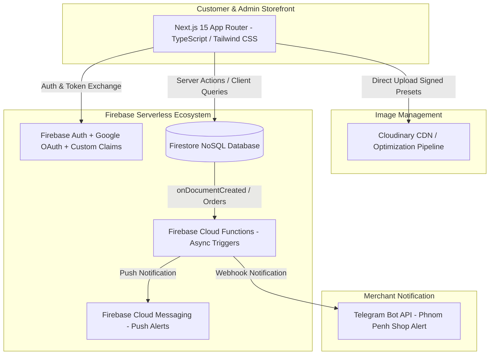
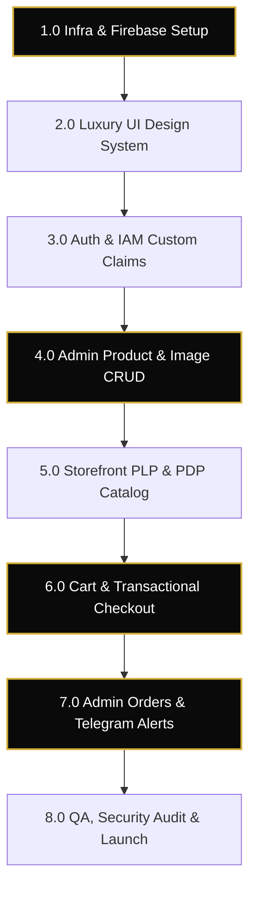
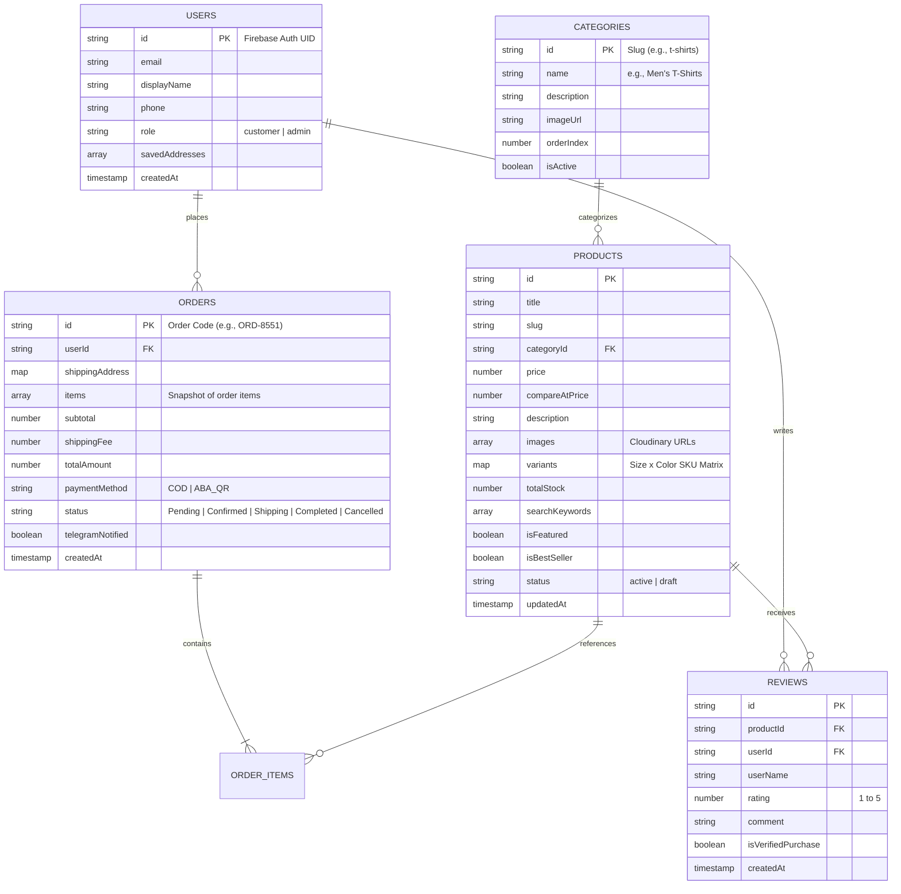
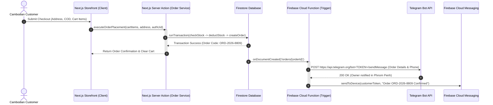
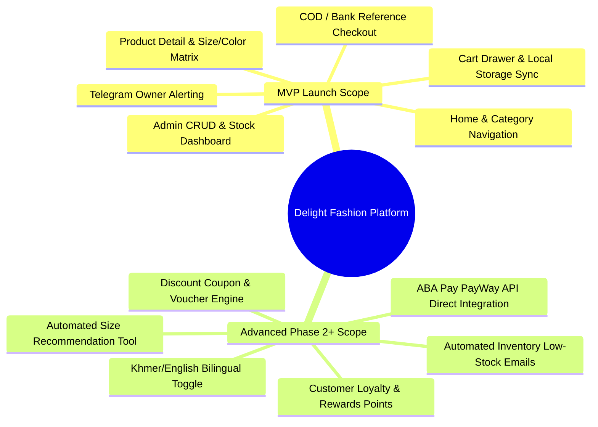

# 🏛️ Delight Fashion: Production-Ready E-Commerce Implementation Plan & Technical Architecture

> **Project Name:** Delight Fashion  
> **Business Domain:** Men's Premium Fashion Retailer (Phnom Penh, Cambodia)  
> **Core Catalog:** T-Shirts, Jackets, Pants, Men's Inner/Work Wear  
> **Document Role:** Senior CTO Architecture, Product Roadmap & Technical Execution Strategy  

---

## 📋 Table of Contents
1. [Executive Summary & Architectural Vision](#1-executive-summary--architectural-vision)
2. [Project Development Phases](#2-project-development-phases)
3. [Complete Task Breakdown (Work Breakdown Structure)](#3-complete-task-breakdown-work-breakdown-structure)
4. [Development Order & Dependency Graph](#4-development-order--dependency-graph)
5. [Production Folder Architecture](#5-production-folder-architecture)
6. [Firestore Database Design & Schemas](#6-firestore-database-design--schemas)
7. [API & Service Architecture](#7-api--service-architecture)
8. [Comprehensive Security & Authorization Plan](#8-comprehensive-security--authorization-plan)
9. [Project Timeline & Resource Estimation](#9-project-timeline--resource-estimation)
10. [MVP Scope vs. Advanced Roadmap](#10-mvp-scope-vs-advanced-roadmap)
11. [CTO Architectural Audit & Self-Correction](#11-cto-architectural-audit--self-correction)

---

## 1. Executive Summary & Architectural Vision

Delight Fashion is designed as a high-performance, mobile-first, luxury e-commerce platform tailored for the modern men's fashion market in Phnom Penh, Cambodia. The architecture pairs the **Next.js App Router (TypeScript)** with a server-less **Firebase ecosystem** and **Cloudinary** CDN image management, ensuring instant page loads, robust SEO, and frictionless checkout.

### 🎨 Brand & UX Direction
- **Aesthetic:** Minimalist, high-end luxury editorial feel.
- **Color Palette:**
  - **Deep Charcoal / Black (`#0A0A0A`)**: Dominant backdrop for authority and contrast.
  - **Crisp White (`#FFFFFF`) & Off-White (`#F9F9F9`)**: Clean typography and product canvas.
  - **Metallic Gold Accent (`#D4AF37`)**: Interactive badges, CTA buttons, and premium highlights.
- **Micro-interactions:** Smooth animations via Framer Motion, skeleton loaders, and tactile button feedback.



---

## 2. Project Development Phases

> [!IMPORTANT]
> Each phase is designed to be self-contained, verifiable, and deployable to staging on **Vercel**, ensuring continuous feedback from stakeholders.

### Phase 1: Project Architecture & Core Infrastructure Setup
- **Objective:** Establish the foundation, development environment, linting rules, Firebase project, and CI/CD pipeline.
- **Tasks:**
  - Initialize Next.js with TypeScript, Tailwind CSS, and ESLint.
  - Configure Firebase project (Auth, Firestore, Messaging) and environments (`.env.local`, `.env.production`).
  - Set up Cloudinary account and upload signature presets.
  - Connect Git repository to Vercel for automated staging and production previews.
- **Subtasks:**
  - Define custom Tailwind color tokens (`brand-black`, `brand-gold`, `brand-white`).
  - Create standard response wrapper utilities and error handlers.
- **Expected Result:** A clean, building Next.js application deployed to Vercel with environment variables wired and accessible.
- **Estimated Difficulty:** ⭐⭐☆☆☆ (Low-Medium)
- **Dependencies:** None.

### Phase 2: Design System, Theme & Shared Components
- **Objective:** Build a reusable, accessible UI component library embodying the luxury Black/White/Gold aesthetic.
- **Tasks:**
  - Create atomic components: Buttons, Badges, Modals, Drawers, Inputs, and Cards.
  - Implement luxury layout shells: Storefront Header/Navbar, Responsive Mobile Drawer, Footer, and Admin Sidebar.
  - Build skeleton loaders and empty-state illustrations.
- **Subtasks:**
  - Integrate responsive breakpoints and typography scales (Google Fonts: Outfit / Inter).
  - Add micro-animations using CSS transitions and Framer Motion for hover/press states.
- **Expected Result:** A cohesive component showcase displaying buttons, product cards, and navigation across mobile and desktop.
- **Estimated Difficulty:** ⭐⭐⭐☆☆ (Medium)
- **Dependencies:** Phase 1.

### Phase 3: Firebase Authentication & Security IAM
- **Objective:** Enable frictionless customer onboarding via Google Sign-In & Email/Password, and establish role-based Admin authorization.
- **Tasks:**
  - Integrate Firebase Authentication Client SDK & Next.js session management.
  - Implement Google OAuth provider and Email/Password sign-up/in flows.
  - Create user profile synchronization in Firestore (`/users/{uid}`).
  - Develop Admin Custom Claims script and Role-Based Access Control (RBAC) middleware.
- **Subtasks:**
  - Add account deletion/logout utilities and session persistence checks.
  - Build protected route middleware for `/admin/*` and `/account/*`.
- **Expected Result:** Secure authentication system where customers can log in via Google/email and admins gain exclusive dashboard access.
- **Estimated Difficulty:** ⭐⭐⭐☆☆ (Medium)
- **Dependencies:** Phase 1, Phase 2.

### Phase 4: Product Management & Cloudinary Asset Pipeline (Admin Core)
- **Objective:** Empower the shop owner to manage inventory, categories, sizes, colors, and product imagery.
- **Tasks:**
  - Build Admin CRUD interfaces for Categories and Products.
  - Build secure Cloudinary image upload widget with multi-image ordering and cropping.
  - Implement stock management and SKU variant matrix (Size × Color).
- **Subtasks:**
  - Add search and filtering in the Admin product table.
  - Build bulk stock update and status toggle (Active/Draft/Out of Stock).
- **Expected Result:** A fully functional Admin Product Dashboard capable of creating and publishing rich product listings.
- **Estimated Difficulty:** ⭐⭐⭐⭐☆ (High)
- **Dependencies:** Phase 2, Phase 3.

### Phase 5: Customer Storefront & Catalog Experience
- **Objective:** Deliver a stunning, high-converting browsing experience for shoppers.
- **Tasks:**
  - Develop Home Page: Dynamic Hero Banner, Featured Collection, New Arrivals, and Best Sellers.
  - Create Product Listing Page (PLP) with category filtering, price sorting, and size/color badges.
  - Create Product Detail Page (PDP) with interactive Cloudinary image gallery, size/color selectors, and stock indicator.
- **Subtasks:**
  - Implement SEO metadata generation for PDPs and category pages.
  - Build quick-view modal for rapid browsing on desktop.
- **Expected Result:** A fast, responsive storefront where customers can explore all men's wear categories seamlessly.
- **Estimated Difficulty:** ⭐⭐⭐☆☆ (Medium)
- **Dependencies:** Phase 4.

### Phase 6: Shopping Cart, Checkout & Transactional Order Engine
- **Objective:** Enable smooth cart management and secure, resilient order placement.
- **Tasks:**
  - Build global shopping cart state (local storage + Firestore sync for authenticated users).
  - Develop multi-step Checkout Page: Shipping address, phone number validation (Cambodia formats), and order summary.
  - Create Firestore Transactional Order Placement to atomically verify and deduct SKU stock.
- **Subtasks:**
  - Implement Order Confirmation screen with unique order code.
  - Support Phnom Penh local payment workflows (Cash on Delivery / ABA Bank QR reference).
- **Expected Result:** End-to-end checkout pipeline producing verified order documents in Firestore without stock race conditions.
- **Estimated Difficulty:** ⭐⭐⭐⭐⭐ (Very High)
- **Dependencies:** Phase 3, Phase 5.

### Phase 7: Order Management & Multi-Channel Notification Engine
- **Objective:** Streamline shop owner order fulfillment and keep customers informed.
- **Tasks:**
  - Build Admin Order Management Dashboard: Status pipeline (`Pending` → `Confirmed` → `Shipping` → `Completed` | `Cancelled`).
  - Configure Firebase Cloud Function webhook to send instant **Telegram Bot alerts** to the shop owner upon new order arrival.
  - Configure Firebase Cloud Messaging (FCM) push notifications / order tracking timeline for customers.
- **Subtasks:**
  - Build Customer Order History & Live Tracking Status view.
  - Create printable order invoice/receipt view for physical delivery tags.
- **Expected Result:** Real-time notifications alerting the owner on Telegram within seconds of an order, with full status control in Admin.
- **Estimated Difficulty:** ⭐⭐⭐⭐☆ (High)
- **Dependencies:** Phase 6.

### Phase 8: Quality Assurance, Performance Audit & Production Launch
- **Objective:** Optimize web vitals, audit security rules, test under load, and execute public release.
- **Tasks:**
  - Perform Lighthouse performance audits (target: 95+ Mobile score).
  - Execute comprehensive Firestore security rules penetration testing.
  - Test Telegram notification bot resilience and Firebase offline persistence.
  - Final domain DNS configuration on Vercel (`delightfashion.com.kh`).
- **Subtasks:**
  - Set up error monitoring (Sentry or Firebase Crashlytics/Performance Monitoring).
- **Expected Result:** A live, rock-solid, production-grade e-commerce application ready for Cambodian shoppers.
- **Estimated Difficulty:** ⭐⭐⭐☆☆ (Medium)
- **Dependencies:** Phases 1–7.

---

## 3. Complete Task Breakdown (Work Breakdown Structure)

```
Project: Delight Fashion E-Commerce System
├── 1.0 Infrastructure & Setup
│   ├── Task 1.1: Initialize Next.js 15 App Router + TypeScript + Tailwind
│   ├── Task 1.2: Configure Firebase Project (Auth, Firestore, Messaging)
│   ├── Task 1.3: Configure Cloudinary CDN & Signing Presets
│   └── Task 1.4: Deploy Staging Pipeline on Vercel
├── 2.0 Design System & Core UI
│   ├── Task 2.1: Implement Tailwind Luxury Theme (Black, White, Gold)
│   ├── Task 2.2: Build Core Atomic UI Components (Buttons, Modals, Inputs)
│   ├── Task 2.3: Build Storefront Header, Mobile Drawer & Footer
│   └── Task 2.4: Build Admin Responsive Layout Shell & Navigation
├── 3.0 Authentication & Identity
│   ├── Task 3.1: Configure Firebase Auth SDK & Providers (Google, Email)
│   ├── Task 3.2: Implement Auth Context & Custom Hooks (`useAuth`)
│   ├── Task 3.3: Set up `/users` Profile Document Synchronization
│   └── Task 3.4: Implement Role-Based Access Control (Admin Custom Claims)
├── 4.0 Admin Product & Category System
│   ├── Task 4.1: Create Firestore Categories Management Module
│   ├── Task 4.2: Build Cloudinary Multi-Image Upload & Optimization Component
│   ├── Task 4.3: Implement Product CRUD with Variant Matrix (Size x Color)
│   └── Task 4.4: Build Admin Product Listing, Filtering & Stock Editor
├── 5.0 Storefront Catalog & Discovery
│   ├── Task 5.1: Implement Home Page (Hero, Featured, Best Sellers, New)
│   ├── Task 5.2: Build Dynamic Product Listing Page (PLP) with Filters
│   ├── Task 5.3: Build Product Detail Page (PDP) with Variant Selector
│   └── Task 5.4: Implement Dynamic SEO & Structured Data (JSON-LD)
├── 6.0 Shopping Cart & Transactional Checkout
│   ├── Task 6.1: Develop Persistent Shopping Cart State Management
│   ├── Task 6.2: Build Responsive Slide-over Cart Drawer
│   ├── Task 6.3: Create Multi-Step Checkout Form & Address Validation
│   └── Task 6.4: Implement Atomic Firestore Order Placement Transaction
├── 7.0 Order Processing & Notifications
│   ├── Task 7.1: Build Admin Order Board & Status Transition Handlers
│   ├── Task 7.2: Build Customer Order Tracking & History Dashboard
│   ├── Task 7.3: Set up Firebase Cloud Function for Telegram Bot Alerting
│   └── Task 7.4: Integrate Firebase Cloud Messaging (FCM) Customer Alerts
└── 8.0 Polish, Testing & Production Release
    ├── Task 8.1: Complete End-to-End Test Suite across User & Admin Journeys
    ├── Task 8.2: Audit & Freeze Firestore Security Rules (`firestore.rules`)
    ├── Task 8.3: Optimize Image Quality, WebVitals & SEO Performance
    └── Task 8.4: Execute Final Domain Cutover & Launch Checklist
```

---

## 4. Development Order & Dependency Graph

> [!TIP]
> **Why Order Matters:** Never build storefront UI against mock data if schema validation isn't locked down. Build from **Schema → Core Auth/Admin CRUD → Public Catalog → Transactional Checkout → Async Alerts**.



### 🔨 What Should Be Built First?
1. **Design System & Tailwind Tokens:** Guarantees every component immediately fits the high-end Black/White/Gold brand aesthetic.
2. **Database Schema & Admin CRUD:** A storefront cannot exist without real products. Admin product creation with Cloudinary image upload must be operational early so realistic men's fashion items can be loaded.

### ⏳ What Should Be Built After?
1. **Public Catalog (PLP / PDP):** Built once real Firestore product data is flowing from the Admin dashboard.
2. **Shopping Cart & Checkout:** Requires fully established product structures and pricing variants.

### 🚫 What Should NOT Be Built Too Early?
1. **Telegram & FCM Notifications:** Attempting to wire webhooks before the order document schema is frozen leads to repeated refactoring.
2. **Advanced Analytics & Loyalty Points:** Adds cognitive load and architectural noise during the MVP build.
3. **Complex Payment Gateway API Integrations:** In Cambodia, manual bank QR (ABA) and COD account for >80% of retail transactions; get these rock-solid before adding card processors.

---

## 5. Production Folder Architecture

We utilize a modular, feature-scoped Next.js App Router architecture that strictly separates Client Components, Server Actions, Firebase Admin/Client configs, and Domain Services.

```
delight-fashion/
├── src/
│   ├── app/                           # Next.js 15 App Router
│   │   ├── (storefront)/              # Customer Storefront Route Group
│   │   │   ├── page.tsx               # Homepage (Hero, Featured, Categories)
│   │   │   ├── products/
│   │   │   │   ├── page.tsx           # Product Listing Page (PLP)
│   │   │   │   └── [slug]/
│   │   │   │       └── page.tsx       # Product Detail Page (PDP)
│   │   │   ├── cart/                  # Shopping Cart View
│   │   │   ├── checkout/              # Checkout & Address Form
│   │   │   ├── account/               # Customer Profile & Order Tracking
│   │   │   └── layout.tsx             # Shared Storefront Navbar / Footer
│   │   ├── (admin)/                   # Protected Admin Dashboard Route Group
│   │   │   ├── admin/
│   │   │   │   ├── dashboard/         # Revenue & Order Analytics
│   │   │   │   ├── products/          # Product CRUD & Inventory Matrix
│   │   │   │   ├── categories/        # Category Management
│   │   │   │   ├── orders/            # Order Pipeline Management
│   │   │   │   └── customers/         # Customer Directory
│   │   │   └── layout.tsx             # Admin Sidebar & RBAC Guard
│   │   ├── api/                       # Webhooks & Internal Endpoints
│   │   │   ├── telegram-webhook/      # Telegram Bot Action Handlers
│   │   │   └── cloudinary/            # Signed Preset Generator
│   │   ├── layout.tsx                 # Root HTML/Body & Theme Providers
│   │   └── globals.css                # Tailwind Base & Luxury Style Utilities
│   ├── components/                    # Reusable Design System & Shared UI
│   │   ├── ui/                        # Atomic Design System (Button, Modal, Input, Badge)
│   │   ├── storefront/                # Storefront-specific UI (Hero, ProductCard, CartDrawer)
│   │   └── admin/                     # Admin-specific UI (DataTable, StockBadge, StatusSelect)
│   ├── features/                      # Domain-specific Functional Logic
│   │   ├── auth/                      # Authentication Modals, Guard Wrappers
│   │   ├── products/                  # Product Filters, Variant Selectors
│   │   ├── cart/                      # Cart Calculations, Drawer Controller
│   │   └── orders/                    # Order Tracker Timeline, Invoice Renderer
│   ├── services/                      # Backend Data Layer & Server Actions
│   │   ├── firebase/                  # Client & Admin Firebase Wrappers
│   │   │   ├── client.ts              # Client SDK Initialization (Auth, Firestore)
│   │   │   ├── admin.ts               # Firebase Admin SDK (Server Actions/Webhooks)
│   │   │   └── rules/
│   │   │       └── firestore.rules    # Production Security Rules
│   │   ├── products.service.ts        # Product Firestore Queries & Mutations
│   │   ├── orders.service.ts          # Order Placement Transactions & Status Updates
│   │   └── notification.service.ts    # Telegram Bot & FCM API Callers
│   ├── hooks/                         # Custom React Hooks
│   │   ├── useAuth.ts                 # Customer & Admin Session Reader
│   │   ├── useCart.ts                 # Shopping Cart Synchronizer
│   │   └── useFirestoreQuery.ts       # Real-time Subscription Utility
│   ├── types/                         # TypeScript Domain Interfaces
│   │   ├── user.ts                    # UserProfile, AdminClaims
│   │   ├── product.ts                 # Product, Variant, Category, Review
│   │   └── order.ts                   # Order, OrderItem, OrderStatus, ShippingAddress
│   └── utils/                         # Pure Helper Functions
│       ├── currency.ts                # USD / KHR Formatting for Cambodia
│       ├── cloudinary.ts              # URL Transforms & Image Optimization
│       └── validators.ts              # Cambodia Phone Number (`+855`/`0xx`) RegEx
├── public/                            # Static Brand Assets & Favicons
├── firestore.indexes.json             # Firestore Composite Index Definitions
├── tailwind.config.ts                 # Luxury Black/White/Gold Theme Settings
├── tsconfig.json                      # Strict TypeScript Configuration
└── package.json                       # Project Dependencies
```

---

## 6. Firestore Database Design & Schemas

Delight Fashion uses a structured NoSQL schema optimized for **single-request read speed** and **atomic inventory consistency**.



### 1. `users` Collection
Stores customer profiles and shop owner administrative flags.
```json
// Collection: /users/{userId}
{
  "id": "uid_firebase_12345",
  "email": "customer@gmail.com",
  "displayName": "Sokha Vong",
  "phone": "+85512345678",
  "role": "customer",
  "savedAddresses": [
    {
      "id": "addr_1",
      "fullName": "Sokha Vong",
      "phone": "012345678",
      "addressLine1": "St 271, Sangkat Tumnop Teuk",
      "district": "Chamkar Mon",
      "city": "Phnom Penh",
      "isDefault": true
    }
  ],
  "createdAt": "2026-08-02T10:00:00.000Z"
}
```

### 2. `categories` Collection
Supports hierarchical or clean slug-based category browsing.
```json
// Collection: /categories/{categoryId}
{
  "id": "jackets-outerwear",
  "name": "Jackets & Outerwear",
  "slug": "jackets-outerwear",
  "description": "Premium structured jackets and modern outerwear for men.",
  "imageUrl": "https://res.cloudinary.com/delight/image/upload/v1/categories/jackets.jpg",
  "orderIndex": 2,
  "isActive": true
}
```

### 3. `products` Collection
Stores comprehensive product metadata and a `variants` map representing the SKU size/color inventory matrix.
```json
// Collection: /products/{productId}
{
  "id": "prod_jacket_gold_01",
  "title": "Royal Gold-Trim Bomber Jacket",
  "slug": "royal-gold-trim-bomber-jacket",
  "categoryId": "jackets-outerwear",
  "price": 89.00,
  "compareAtPrice": 110.00,
  "description": "Custom-tailored black bomber jacket with subtle gold-accented zippers.",
  "images": [
    {
      "id": "img_01",
      "url": "https://res.cloudinary.com/delight/image/upload/v1/products/bomber_front.jpg",
      "alt": "Royal Bomber Front View",
      "isPrimary": true
    },
    {
      "id": "img_02",
      "url": "https://res.cloudinary.com/delight/image/upload/v1/products/bomber_back.jpg",
      "alt": "Royal Bomber Back View",
      "isPrimary": false
    }
  ],
  "variants": {
    "S_BLACK":  { "size": "S",  "color": "Black", "colorHex": "#0A0A0A", "stock": 5,  "sku": "BOM-GLD-S-BK" },
    "M_BLACK":  { "size": "M",  "color": "Black", "colorHex": "#0A0A0A", "stock": 12, "sku": "BOM-GLD-M-BK" },
    "L_BLACK":  { "size": "L",  "color": "Black", "colorHex": "#0A0A0A", "stock": 8,  "sku": "BOM-GLD-L-BK" },
    "XL_BLACK": { "size": "XL", "color": "Black", "colorHex": "#0A0A0A", "stock": 3,  "sku": "BOM-GLD-XL-BK" }
  },
  "totalStock": 28,
  "availableSizes": ["S", "M", "L", "XL"],
  "availableColors": ["Black"],
  "searchKeywords": ["jacket", "bomber", "black", "gold", "outerwear", "royal"],
  "isFeatured": true,
  "isBestSeller": false,
  "status": "active",
  "createdAt": "2026-08-01T08:30:00.000Z",
  "updatedAt": "2026-08-02T14:15:00.000Z"
}
```

### 4. `orders` Collection
Contains immutable snapshots of ordered items, prices, shipping addresses, and live fulfillment status.
```json
// Collection: /orders/{orderId}
{
  "id": "ORD-2026-8809",
  "userId": "uid_firebase_12345",
  "customerEmail": "customer@gmail.com",
  "shippingAddress": {
    "fullName": "Sokha Vong",
    "phone": "012345678",
    "addressLine1": "St 271, Sangkat Tumnop Teuk",
    "district": "Chamkar Mon",
    "city": "Phnom Penh"
  },
  "items": [
    {
      "productId": "prod_jacket_gold_01",
      "title": "Royal Gold-Trim Bomber Jacket",
      "variantKey": "M_BLACK",
      "size": "M",
      "color": "Black",
      "sku": "BOM-GLD-M-BK",
      "price": 89.00,
      "quantity": 1,
      "imageUrl": "https://res.cloudinary.com/delight/image/upload/v1/products/bomber_front.jpg"
    }
  ],
  "subtotal": 89.00,
  "shippingFee": 2.00,
  "totalAmount": 91.00,
  "paymentMethod": "COD",
  "paymentReference": null,
  "status": "Pending",
  "statusHistory": [
    { "status": "Pending", "timestamp": "2026-08-02T15:00:00.000Z", "note": "Order submitted by customer." }
  ],
  "telegramNotified": true,
  "createdAt": "2026-08-02T15:00:00.000Z"
}
```

### 5. `reviews` Collection
Stores verified customer reviews and star ratings.
```json
// Collection: /reviews/{reviewId}
{
  "id": "rev_01",
  "productId": "prod_jacket_gold_01",
  "userId": "uid_firebase_12345",
  "userName": "Sokha V.",
  "rating": 5,
  "comment": "Incredible quality! The gold zipper detail looks extremely premium. Perfect fit.",
  "isVerifiedPurchase": true,
  "createdAt": "2026-08-02T16:20:00.000Z"
}
```

---

## 7. API & Service Architecture

### Frontend ↔ Firebase Communication Strategy
1. **Public Reads (Client SDK):** Product catalogs, categories, and reviews are fetched directly from the browser using standard Firestore SDK queries (`getDocs`, `onSnapshot`) for instant responsiveness and client-side caching.
2. **Sensitive Writes & Business Logic (Next.js Server Actions / Admin SDK):** Order placement, stock adjustments, and administrative mutations occur strictly within **Next.js Server Actions** running the Firebase Admin SDK on the server, preventing client-side price tampering or inventory bypass.
3. **Image Uploads (Cloudinary Direct):** Images are uploaded directly from the client browser to Cloudinary via a signed upload preset generated securely by a server action, avoiding server bandwidth bottlenecks.



### 🔔 Telegram Bot Notification Workflow (Shop Owner Alert)
When an order document is created in `/orders/{orderId}`, a background Firebase Cloud Function (`notifyTelegramOnNewOrder`) triggers automatically:
- It formats a concise Markdown-styled alert containing:
  - **Order Code:** `ORD-2026-8809`
  - **Customer Phone:** `+855 012 345 678` (clickable phone link for instant callback)
  - **Delivery Address:** `St 271, Sangkat Tumnop Teuk, Chamkar Mon, Phnom Penh`
  - **Item Breakdown:** `1x Royal Gold-Trim Bomber Jacket [M / Black] - $89.00`
  - **Total Amount:** **`$91.00 (COD)`**
- It sends a webhook `POST` request to the shop owner's private Telegram chat/channel.

---

## 8. Comprehensive Security & Authorization Plan

### Role-Based Access Control (RBAC) Hierarchy
- **Customer:** Authenticated user with default permissions. Can read public products, create orders, and manage their own profile and order history.
- **Admin:** Verified staff account with a custom Firebase Auth claim (`admin: true`). Granted global read/write privileges over products, categories, stock, and orders.

### Production `firestore.rules` Security Schema

```javascript
rules_version = '2';
service cloud.firestore {
  match /databases/{database}/documents {
    
    // 🛡️ Helper Functions
    function isAuthenticated() {
      return request.auth != null;
    }
    
    function isOwner(userId) {
      return isAuthenticated() && request.auth.uid == userId;
    }
    
    function isAdmin() {
      return isAuthenticated() && 
        (request.auth.token.admin == true || request.auth.token.role == 'admin');
    }

    // 👤 Users Collection: Customers read/write own profile; Admins read all
    match /users/{userId} {
      allow read: if isOwner(userId) || isAdmin();
      allow create: if isAuthenticated() && request.auth.uid == userId;
      allow update: if isOwner(userId) && !request.resource.data.diff(resource.data).affectedKeys().hasAny(['role', 'id']);
      allow delete: if isAdmin();
    }

    // 📦 Categories Collection: Public read; Admin-only write
    match /categories/{categoryId} {
      allow read: if true;
      allow write: if isAdmin();
    }

    // 👔 Products Collection: Public read for active items; Admin-only write
    match /products/{productId} {
      allow read: if resource.data.status == 'active' || isAdmin();
      allow write: if isAdmin();
    }

    // 🛒 Orders Collection: Customers read own orders; Create via valid schema; Admin full control
    match /orders/{orderId} {
      allow read: if isAuthenticated() && (resource.data.userId == request.auth.uid || isAdmin());
      // Direct client creation blocked if stock tampering is possible; allow only if server action signs or strict validation passes
      allow create: if isAuthenticated() && 
                    request.resource.data.userId == request.auth.uid &&
                    request.resource.data.status == 'Pending';
      allow update: if isAdmin() || (isOwner(resource.data.userId) && request.resource.data.status == 'Cancelled' && resource.data.status == 'Pending');
      allow delete: if isAdmin();
    }

    // ⭐ Reviews Collection: Public read; Authenticated users create; Admins moderate
    match /reviews/{reviewId} {
      allow read: if true;
      allow create: if isAuthenticated() && request.resource.data.userId == request.auth.uid;
      allow update, delete: if isAdmin() || (isAuthenticated() && resource.data.userId == request.auth.uid);
    }
  }
}
```

---

## 9. Project Timeline & Resource Estimation

The timeline below compares expected execution velocity across three developer experience tiers, from project scaffolding to production deployment.

| Phase # | Phase Name | Beginner Developer | Intermediate Developer | Senior Full-Stack Lead |
| :---: | :--- | :---: | :---: | :---: |
| **1** | Core Architecture & Setup | 1.5 Weeks | 4 Days | 1.5 Days |
| **2** | Design System & Luxury UI | 2.5 Weeks | 1.5 Weeks | 4 Days |
| **3** | Auth & Admin IAM Security | 2 Weeks | 1 Week | 2.5 Days |
| **4** | Product & Cloudinary Admin | 3 Weeks | 1.5 Weeks | 4 Days |
| **5** | Storefront & Catalog Experience | 2.5 Weeks | 1.5 Weeks | 4 Days |
| **6** | Cart & Transactional Checkout | 3 Weeks | 1.5 Weeks | 5 Days |
| **7** | Order Admin & Telegram Alerts | 2 Weeks | 1 Week | 3 Days |
| **8** | QA, Security Audit & Launch | 1.5 Weeks | 1 Week | 2 Days |
| **Total** | **End-to-End Implementation** | **~18 Weeks (4.5 Months)** | **~9.5 Weeks (~2.2 Months)** | **~3.7 Weeks (< 1 Month)** |

---

## 10. MVP Scope vs. Advanced Roadmap

To ensure rapid time-to-market and immediate revenue generation for Delight Fashion in Phnom Penh, features are strictly triaged into an **MVP First Launch** and an **Advanced Phase 2 Roadmap**.



### 🚀 MVP Features (First Launch Requirements)
- Responsive luxury storefront (Home, PLP, PDP) with Black/White/Gold aesthetic.
- Full Admin Dashboard for Product CRUD, Cloudinary multi-image upload, and SKU stock tracking.
- Frictionless Checkout supporting **Cash on Delivery (COD)** and **ABA Bank QR reference note**.
- Automated **Telegram Bot push alerts** to the shop owner upon order creation.
- Customer Order Tracking status page (`Pending`, `Confirmed`, `Shipping`, `Completed`).

### 💎 Advanced Features (Future Enhancements)
- **Bilingual Support (English / Khmer):** Language toggle using `next-intl` for local Cambodian shoppers.
- **Direct PayWay / ABA Bank QR Gateway API:** Automated QR scanning and webhook confirmation without manual screenshot checks.
- **AI Size Recommender:** Interactive modal estimating fit based on customer height/weight.
- **Loyalty & Membership Program:** Earn points per dollar spent redeemable on future clothing drops.
- **Promotional Discounts & Coupon Code Engine:** Fixed amount and percentage-based voucher codes with expiration dates.

---

## 11. CTO Architectural Audit & Self-Correction

A rigorous technical evaluation of the proposed plan reveals **5 critical e-commerce challenges specific to Firestore and the Cambodian retail market**, along with their engineered solutions:

### ⚠️ Problem 1: Race Conditions in Inventory Stock Deduction on Firestore
- **Risk:** If two shoppers simultaneously order the last `M / Black` bomber jacket, a simple client-side read-modify-write will result in overselling and negative stock.
- **CTO Architectural Fix:** All order creations MUST be processed via an **Atomic Firestore Transaction** (`runTransaction`) inside a Next.js Server Action. The transaction reads the SKU `stock` property, verifies `stock >= requestedQuantity`, decrements the stock, and creates the order in a single atomic database lock. If stock is insufficient, the transaction aborts cleanly with a clear user alert.

### ⚠️ Problem 2: Cambodian Retail Payment & Address Realities
- **Risk:** Standard Western checkout forms requiring postal codes, state/province selections, and credit card gateways fail in Phnom Penh where **Cash on Delivery (COD)** and **ABA Bank Instant Transfers** dominate, and street addresses rely on Sangkat/Khan landmarks.
- **CTO Architectural Fix:** 
  - Replace generic address fields with Cambodia-tailored fields: `Full Name`, `Phone Number (with +855 / 0xx validation)`, `Sangkat / District`, and `Street / Building / Delivery Note`.
  - Provide a dedicated **"ABA Bank Transfer"** checkout option displaying the shop's ABA QR Code, allowing users to input their transaction reference number or upload a transfer screenshot directly to Cloudinary.

### ⚠️ Problem 3: Telegram Bot Rate Limiting & Webhook Reliability
- **Risk:** If a network blip or Telegram API timeout occurs when a customer checks out, synchronous webhook calls could fail, causing the shop owner to miss an order notification.
- **CTO Architectural Fix:** Decouple order creation from Telegram alerting. Use an asynchronous **Firebase Cloud Function trigger** (`onDocumentCreated('/orders/{orderId}')`). If Telegram's API fails, Firebase automatically retries the function call with exponential backoff, guaranteeing zero lost order notifications.

### ⚠️ Problem 4: Cloudinary Image Delivery & Mobile Bandwidth Optimization
- **Risk:** High-resolution fashion photography (3MB+ per photo) will degrade mobile page loading speeds in Cambodia, hurting UX and conversion rates.
- **CTO Architectural Fix:** Implement a centralized Cloudinary image URL transformation utility (`getOptimizedImageUrl(url, width, height)`). Automatically inject parameters `f_auto,q_auto,c_fill,g_auto` to serve compressed **WebP/AVIF** formats tailored to the exact device breakpoint and enforce strict **3:4 portrait aspect ratios** for consistent apparel grids.

### ⚠️ Problem 5: Firestore Query Inequalities & Category Filter Constraints
- **Risk:** Firestore prohibits compound range filters across different fields without explicit composite indexes, which can crash category filtering if not planned.
- **CTO Architectural Fix:** Precompute and denormalize array attributes on the product document (`availableSizes: ['S', 'M', 'L']`, `availableColors: ['Black', 'Gold']`, `status: 'active'`). Define all required composite queries upfront inside `firestore.indexes.json` so category, price sorting, and size filtering execute in single-digit milliseconds.
